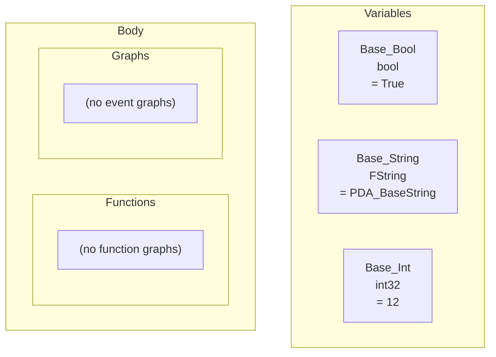

# Mermaid Diagrams

Mermaid turns Blueprint graphs into **flowchart diagrams** that render in GitHub, GitLab, Notion, and many other tools,
no screenshots needed.

## What you get

Exporting to Mermaid produces a `.mmd` file containing a `flowchart TB` diagram. Paste it into any Mermaid-rendering
page (or [mermaid.live](https://mermaid.live)) and it becomes a visual flowchart of your graph.

The diagram is structured in three areas:

- a **Variables** subgraph (`SG_VARS`), one node per variable, labeled `Name<br/>Type<br/>= value`,
- a **Body** subgraph (`SG_BODY`) holding a **Functions** subgraph (`SG_FUNCS`) and a **Graphs** subgraph (`SG_GRAPHS`),
- node colors via `classDef`s (event/call/struct/switch...) and variable-type colors (`v_bool`, `v_float`, ...) assigned
  with `class` statements.

A condensed real export (from the example content shipped with the plugin, `DA_Test.mmd`, a DataAsset with no
graphs, so the body shows the empty placeholders):



For Blueprints with graphs, the body subgraphs contain the actual flow: exec edges between nodes (`-->`), labeled
data edges (`-.->`), and the same color classes. Widget Blueprints add a `SG_WIDGETS` subgraph with the nested
widget hierarchy, and Widget animations get an `SG_ANIMS` subgraph. Rendering the file on GitHub or mermaid.live
gives you the diagram.


## Where Mermaid renders

- **GitHub**, in READMEs, issues, and PRs via ` ```mermaid ` fenced blocks
- **GitLab**, same syntax, same result
- **Notion**, pasted Mermaid blocks

## A note on readability

Large graphs get hard to read as diagrams. The export dialog warns you when a Mermaid export exceeds your configured
[Mermaid Warn Node Count](/guide/settings) and suggests Markdown. For reading the *details* of a graph (pin values,
defaults, exact calls), use the [Markdown output](/guide/markdown-output) instead it's more precise. Think of Mermaid
as the picture and Markdown as the spec.
